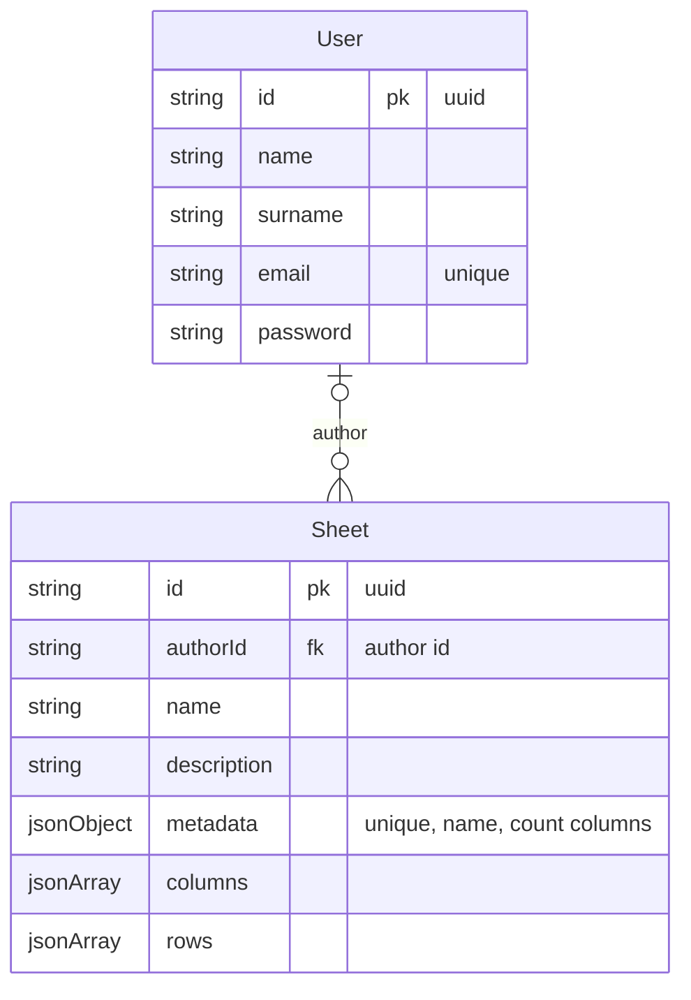

# System design

## Requirements

- import `xlsx` files (exceljs);
- merge tables with new `xlsx` files (exceljs);
- filtering and searching by table (client or server?);
- generating reports in docx (reportjs);

Database structure:

